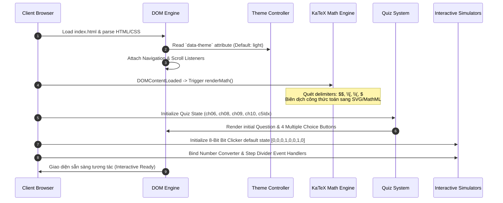

# 📐 TÀI LIỆU THIẾT KẾ KIẾN TRÚC & HỆ THỐNG (SYSTEM DESIGN DOCUMENT)
## Dự Án: CEA201 — Computer Organization & Architecture: Master Study Guide

---

## 1. TỔNG QUAN DỰ ÁN (PROJECT OVERVIEW)

### 1.1. Mục Tiêu & Sứ Mệnh
**CEA201 Master Study Guide** là một ứng dụng web học tập tương tác (Interactive Single-Page Study Platform) được thiết kế chuyên biệt để phục vụ việc ôn tập, tra cứu chuyên sâu và mô phỏng thực hành toàn diện 21 chương của học phần **CEA201 (Kiến Trúc & Tổ Chức Máy Tính - Computer Organization and Architecture)** theo giáo trình chuẩn quốc tế của *William Stallings (11th Edition)*.

Hệ thống giải quyết các bài toán then chốt trong giáo dục kỹ thuật:
- **Trực quan hóa các khái niệm trừu tượng**: Thay vì học lý thuyết khô khan, sinh viên được tương tác trực tiếp với các mô hình bit bù hai (Two's Complement), bộ chuyển đổi hệ cơ số theo từng bước chia dư, chu kỳ xung nhịp vi lệnh (Micro-operations), trạng thái bộ nhớ đệm MESI, và thanh tiến trình hiệu năng đa nhân.
- **Tập trung hóa tri thức (All-in-One)**: Tích hợp đầy đủ lý thuyết, bảng tra cứu, công thức toán học KaTeX, mã lệnh Assembly, sơ đồ phần cứng và hệ thống đề thi trắc nghiệm trong một tệp duy nhất.
- **Trải nghiệm học tập hiện đại**: Hỗ trợ giao diện kép Sáng/Tối (Light/Dark Mode), công cụ tìm kiếm tức thì `Ctrl + K`, chỉ mục cuộn thông minh (ScrollSpy) và thanh tiến trình đọc thời gian thực.

### 1.2. Phạm Vi Thiết Kế (Scope)
- **Nền tảng mục tiêu**: Web Browser hiện đại (Chrome, Edge, Firefox, Safari) trên Desktop, Tablet và Mobile.
- **Mô hình triển khai**: 100% Client-Side Static Single Page Application (SPA), Zero-Build Step, tương thích hoàn toàn với GitHub Pages và các dịch vụ CDN tĩnh.
- **Không phụ thuộc Backend**: Tất cả dữ liệu bài học, thuật toán mô phỏng, quiz trắc nghiệm và logic tìm kiếm đều được xử lý tối ưu tại client bằng JavaScript thuần (Vanilla JS).

---

## 2. KIẾN TRÚC TỔNG THỂ (SYSTEM ARCHITECTURE)

### 2.1. Triết Lý Kiến Trúc: Zero-Build Monolithic SPA
Ứng dụng áp dụng kiến trúc **Single-File Monolithic Component** (Toàn bộ HTML, CSS và JS được đóng gói tối ưu trong một tệp `index.html`), kết hợp tài nguyên ngoại vi chất lượng cao qua CDN (Google Fonts, KaTeX Engine).

```
+-----------------------------------------------------------------------------------+
|                                 CLIENT BROWSER                                    |
+-----------------------------------------------------------------------------------+
|  [ Presentation Layer: Modern Glassmorphic UI ]                                   |
|  - Master Header (Brand, Real-time Search Box, Dual Theme Toggle)                 |
|  - Dynamic Sidebar (Part Groups 1-5, Chapter Badges, ScrollSpy Anchor Links)      |
|  - Master Main (Hero Banner, Interactive Micro-Tools, 20 Chapter Sections)        |
|  - Floating Action Dock (Back to Top, Reading Progress Indicator)                 |
+-----------------------------------------------------------------------------------+
|  [ Interactive Micro-Applications & Simulation Engines ]                          |
|  +------------------------+  +------------------------+  +---------------------+  |
|  | 8-Bit Two's Complement |  | Radix & Division Steps |  | Control Unit Subtabs|  |
|  | Bit Clicker Simulator  |  | Number Base Converter  |  | Micro-op Sequencer  |  |
|  +------------------------+  +------------------------+  +---------------------+  |
|  +------------------------+  +------------------------+  +---------------------+  |
|  | Multi-Chapter Quiz     |  | Multicore Animated     |  | KaTeX LaTeX Formula |  |
|  | Evaluation Engine      |  | Performance Bars       |  | Auto-Render Pipeline|  |
|  +------------------------+  +------------------------+  +---------------------+  |
+-----------------------------------------------------------------------------------+
|  [ Core UI Services & State Management (Vanilla JS Engine) ]                      |
|  - Theme Controller (CSS Variable Swap: Light <-> Dark)                           |
|  - Live DOM Search & Highlight Indexer (Keyboard Shortcut Ctrl+K)                 |
|  - ScrollSpy & IntersectionObserver Scroll-Reveal Driver                          |
|  - Quiz State Store & Verification Handler                                        |
+-----------------------------------------------------------------------------------+
|  [ External CDN Dependencies ]                                                    |
|  - Google Fonts (JetBrains Mono, Outfit, Plus Jakarta Sans, Sora, Syne)           |
|  - KaTeX 0.16.9 (Math Engine & Auto-render extension)                             |
+-----------------------------------------------------------------------------------+
```

### 2.2. Vòng Đời Thực Thi Của Ứng Dụng (Execution Lifecycle)



---

## 3. THIẾT KẾ GIAO DIỆN & HỆ THỐNG DESIGN SYSTEM (UI/UX DESIGN SPECIFICATION)

### 3.1. Bảng Màu Hệ Thống & CSS Custom Variables (Design Tokens)

Hệ thống sử dụng bộ biến CSS (CSS Variables) phân cấp rõ ràng theo 2 chế độ hiển thị:

| Biến CSS Token | Giá Trị Light Mode | Giá Trị Dark Mode | Vai Trò & Mục Đích Sử Dụng |
| :--- | :--- | :--- | :--- |
| `--bg-body` | `#f8fafc` (Slate-50) | `#090d16` (Deep Midnight) | Màu nền canvas tổng thể |
| `--bg-surface` | `#ffffff` | `#111827` (Gray-900) | Nền của Container chính, Modal, Bảng |
| `--bg-surface-subtle` | `#f1f5f9` | `#1e293b` (Slate-800) | Nền ô nhập liệu, box phụ, item danh sách |
| `--bg-sidebar` | `#ffffff` | `#0f172a` (Slate-900) | Nền của thanh điều hướng dọc |
| `--bg-header` | `rgba(255, 255, 255, 0.94)` | `rgba(15, 23, 42, 0.94)` | Nền thanh Top Navbar có kính mờ Blur |
| `--bg-card` | `#ffffff` | `#131d2f` (Deep Navy) | Nền thẻ bài học (Topic Card, Card) |
| `--bg-code` | `#0f172a` | `#030712` (True Black) | Nền khối lệnh Assembly và Code |
| `--text-primary` | `#0f172a` | `#f8fafc` | Chữ tiêu đề, văn bản chính |
| `--text-secondary` | `#334155` | `#cbd5e1` | Nội dung mô tả, đoạn văn giải thích |
| `--text-muted` | `#64748b` | `#94a3b8` | Chú thích phụ, nhãn nhỏ, số thứ tự |
| `--border-color` | `#e2e8f0` | `#1e293b` | Đường kẻ phân cách, viền card |
| `--accent-primary` | `#2563eb` (Blue-600) | `#60a5fa` (Blue-400) | Màu nhấn chủ đạo (Brand, Active Link, CTA) |

#### Bảng Màu Phân Vùng Kiến Thức (Part-specific Color Identity):
Nhằm tăng tính trực quan khi duyệt tài liệu, mỗi phần kiến thức lớn được gán một bộ định danh màu riêng biệt:
- 🔵 **Phần 1 (Chương 1 - 5)**: *Sky/Blue* (`--part1-color: #0284c7; --part1-bg: #e0f2fe;`) — Tổng quan, Tiến hóa & Hiệu năng.
- 🟣 **Phần 2 (Chương 6 - 10)**: *Indigo* (`--part2-color: #4f46e5; --part2-bg: #eef2ff;`) — Bộ nhớ trong, I/O, OS & Hệ cơ số.
- 🟢 **Phần 3 (Chương 11 - 14)**: *Emerald* (`--part3-color: #059669; --part3-bg: #d1fae5;`) — Số học ALU, Mạch số & Tập lệnh.
- 🟠 **Phần 4 (Chương 15 - 18)**: *Amber* (`--part4-color: #d97706; --part4-bg: #fef3c7;`) — Hợp ngữ x86, Pipeline & RISC/CISC.
- 🟪 **Phần 5 (Chương 19 - 21)**: *Purple* (`--part5-color: #7c3aed; --part5-bg: #ede9fe;`) — Khối điều khiển Control Unit, Đa xử lý & Multicore.

---

### 3.2. Hệ Thống Typography (Font Hierarchy)

Ứng dụng kết hợp 4 bộ font hiện đại chuẩn quốc tế từ Google Fonts:

```
+--------------------------------------------------------------------------------------+
|  Plus Jakarta Sans / Inter       -> Body, đoạn văn bản, bảng dữ liệu, mô tả lý thuyết |
|  Outfit / Sora                   -> Tiêu đề chính (h1, h2, h3), Brand Title, Chapter #|
|  JetBrains Mono                  -> Đoạn mã Assembly, hệ nhị phân, công thức, thanh ghi|
|  Syne                            -> Điểm nhấn thương hiệu, huy hiệu đặc biệt          |
+--------------------------------------------------------------------------------------+
```

- **Thân bài (Body text)**: Font-size: `15px`, Line-height: `1.65`, Font-weight: `400 / 500`.
- **Tiêu đề chương (h2)**: Font-size: `1.7rem`, Font-weight: `800`, Letter-spacing: `-0.02em`.
- **Khối mã lệnh (Code blocks)**: Font-size: `0.88rem`, Line-height: `1.55`, Font-family: `'JetBrains Mono', monospace`.

---

### 3.3. Bố Cục Giao Diện & Thiết Kế Responsive (Layout Architecture)

Bố cục được chia thành cấu trúc **Sticky Header + Fixed Sidebar + Fluid Main Content**:

```
+-----------------------------------------------------------------------------------+
| Top Master Header (Fixed height: 64px, Glassmorphism blur: 12px, z-index: 900)   |
| [☰ Menu] [🏷️ CEA201 Master]      [🔍 Real-time Search Box]           [☀️/🌙 Theme]|
+-------------------+---------------------------------------------------------------+
| Master Sidebar    | Master Main Content (Max-width: 1300px, Auto scroll)          |
| (Width: 300px     | ------------------------------------------------------------- |
| Fixed Left,       | 🚀 HERO BANNER (Stats, Quick Jump Pills)                      |
| Custom Scrollbar) | ------------------------------------------------------------- |
|                   | 📘 PART 1 DIVIDER BANNER                                      |
| - Part 1 Group    |   ├── Chapter 1: Basic Concepts & Evolution                   |
|   ├── Ch 1 Link   |   ├── Chapter 2: Performance Concepts (Amdahl's Law)          |
|   ├── Ch 2 Link   |   ├── Chapter 3: Top-Level Interconnection & Bus             |
|   └── ...         |   ├── Chapter 4: Memory Hierarchy                             |
| - Part 2 Group    |   └── Chapter 5: Cache Memory & Set-Associative + Quiz        |
| - Part 3 Group    | ------------------------------------------------------------- |
| - Part 4 Group    | 📙 PART 2 DIVIDER BANNER (Ch 6, 8, 9, 10 + Radix Tool)        |
| - Part 5 Group    | 📗 PART 3 DIVIDER BANNER (Ch 11 - 14 + Two's Comp Tool)       |
|                   | 📙 PART 4 DIVIDER BANNER (Ch 15 - 18 + Pipeline Stages)       |
|                   | ⚡ PART 5 DIVIDER BANNER (Ch 19 - 21 + MESI + Multicore Bars) |
+-------------------+---------------------------------------------------------------+
| Bottom-Right Floating Action Dock: [⬆ Back to Top Button] (Visible on scroll > 400px)
+-----------------------------------------------------------------------------------+
```

#### Quy Chuẩn Điểm Ngắt (Responsive Breakpoints):
1. **Màn Hình Lớn (Desktop > 1024px)**:
   - Sidebar cố định 300px bên trái.
   - Khoảng cách lề chính: `padding: 2rem 2.5rem 6rem;`.
   - Lưới thẻ card (`.card-grid`): Tự động dàn đều `repeat(auto-fit, minmax(320px, 1fr))`.
2. **Máy Tính Bảng (Tablet 768px – 1024px)**:
   - Sidebar thu gọn về 260px.
   - Thanh Search Box trên header tự động co giãn linh hoạt.
3. **Điện Thoại Di Động (Mobile < 768px)**:
   - Sidebar ẩn hoàn toàn (`transform: translateX(-100%)`), chuyển thành Drawer mở trượt bằng nút `☰ Nav Toggle`.
   - Main content chiếm 100% chiều rộng màn hình.
   - Header Search chuyển vào trạng thái thu gọn nhằm tối ưu không gian hiển thị.

---

## 4. PHÂN TÍCH CHI TIẾT CẤU TRÚC 5 PHẦN KIẾN THỨC (20 CHƯƠNG)

Mỗi chương học trong hệ thống được thiết kế theo một cấu trúc mẫu chuẩn mực (Modular Section Blueprint):
`Chapter Header Badge` ➔ `Concept Cards Grid` ➔ `Styled Comparison Tables` ➔ `Mathematical Formulas (KaTeX)` ➔ `Step-by-step Procedures` ➔ `Interactive Visualizer/Quiz`.

```mermaid
graph TD
    Root[CEA201 Master Study Guide] --> P1[Phần 1: Tổng Quan & Hiệu Năng]
    Root --> P2[Phần 2: Bộ Nhớ & Hệ Điều Hành]
    Root --> P3[Phần 3: Số Học & Mạch Logic]
    Root --> P4[Phần 4: Hợp Ngữ, Vi Xử Lý & RISC]
    Root --> P5[Phần 5: Điều Khiển & Đa Nhân]

    P1 --> Ch1[Ch 1: Basic Concepts & Evolution]
    P1 --> Ch2[Ch 2: Performance Concepts]
    P1 --> Ch3[Ch 3: Function & Interconnection Bus]
    P1 --> Ch4[Ch 4: Memory Hierarchy]
    P1 --> Ch5[Ch 5: Cache Memory & Quiz]

    P2 --> Ch6[Ch 6: Internal Memory & Hamming SEC]
    P2 --> Ch8[Ch 8: I/O Systems & DMA]
    P2 --> Ch9[Ch 9: Operating System Support & Paging]
    P2 --> Ch10[Ch 10: Number Systems & Radix Converter]

    P3 --> Ch11[Ch 11: Computer Arithmetic & Two's Comp Clicker]
    P3 --> Ch12[Ch 12: Digital Logic & Boolean Gates]
    P3 --> Ch13[Ch 13: Instruction Sets: Characteristics]
    P3 --> Ch14[Ch 14: Addressing Modes & Formats]

    P4 --> Ch15[Ch 15: Assembly Language x86/NASM]
    P4 --> Ch16[Ch 16: Processor Structure & Pipeline Hazards]
    P4 --> Ch17[Ch 17: Reduced Instruction Set Computers - RISC]
    P4 --> Ch18[Ch 18: Instruction-Level Parallelism & Superscalar]

    P5 --> Ch19[Ch 19: Control Unit Operations & Subcycles]
    P5 --> Ch20[Ch 20: Parallel Processing & MESI Protocol]
    P5 --> Ch21[Ch 21: Multicore Computers & Speedup Curves]
```



### 4.1. Phần 1: Tổng Quan, Tiến Hóa & Hiệu Năng (Chương 1 – 5)
- **Chương 1: Khái Niệm Cơ Bản & Tiến Hóa Máy Tính**:
  - Phân biệt *Computer Architecture* (Thuộc tính logic nhìn thấy bởi lập trình viên: Tập lệnh, số bit, cơ chế I/O) vs *Computer Organization* (Hiện thực phần cứng vật lý: Tín hiệu điều khiển, công nghệ nhớ).
  - Cấu trúc Von Neumann kinh điển (CPU, Memory, I/O, System Bus; lưu trữ chương trình và dữ liệu chung trong bộ nhớ).
  - 4 thế hệ máy tính: Bóng đèn chân không (Vacuum Tubes), Transistor rời, Vi mạch tích hợp bán dẫn (SSI/MSI/LSI/VLSI), Siêu vi mạch Ultra Large Scale Integration (ULSI).
  - Dòng vi xử lý Intel x86 & Kiến trúc ARM (Acorn/Advanced RISC Machine).
- **Chương 2: Đánh Giá Hiệu Năng Máy Tính (Performance Metrics)**:
  - Tần số xung nhịp (Clock Speed, $f = \frac{1}{\tau}$), Thời gian thực thi CPU ($T_{cpu} = I_c \times CPI \times \tau$).
  - **Định luật Amdahl (Amdahl's Law)**: Tính toán mức tăng tốc tối đa (Speedup) khi song song hóa $f$ tỷ lệ công việc trên $N$ lõi:
    $$\text{Speedup} = \frac{1}{(1 - f) + \frac{f}{N}}$$
  - **Định luật Little (Little's Law)**: Tính số lượng tác vụ trong hàng đợi hệ thống: $L = \lambda \times W$.
  - MIPS (Millions of Instructions Per Second) và MFLOPS.
- **Chương 3: Chức Năng Máy Tính & Liên Kết Bus (Interconnection)**:
  - Chu kỳ lệnh cơ bản (Instruction Cycle: Fetch $\rightarrow$ Execute $\rightarrow$ Interrupt).
  - Cơ chế ngắt (Interrupts): I/O Interrupts, Hardware Failure, Timer, Program Exception (Chia cho 0, Overflow).
  - Cấu trúc Bus hệ thống: Data Bus (chiều rộng quyết định số bit truyền/lần), Address Bus (chiều rộng quyết định dung lượng địa chỉ tối đa $2^k$), Control Bus (Read/Write, Memory/IO, Clock, Reset).
  - Kiến trúc Point-to-Point hiện đại: Intel QPI (QuickPath Interconnect) và PCIe (PCI Express).
- **Chương 4: Phân Cấp Bộ Nhớ (Memory Hierarchy)**:
  - Kim tự tháp bộ nhớ: Registers $\rightarrow$ Cache (L1, L2, L3) $\rightarrow$ Main Memory (RAM) $\rightarrow$ Secondary Storage (SSD/HDD) $\rightarrow$ Offline Storage.
  - 2 nguyên lý cục bộ quan trọng (Principle of Locality):
    - *Temporal Locality (Cục bộ theo thời gian)*: Dữ liệu vừa truy cập sẽ có khả năng cao được truy cập lại sớm (vòng lặp, biến đếm).
    - *Spatial Locality (Cục bộ theo không gian)*: Ô nhớ kế cận ô nhớ vừa truy cập sẽ có khả năng cao được truy cập tiếp theo (duyệt mảng, thực thi lệnh tuần tự).
- **Chương 5: Bộ Nhớ Đệm Cache (Cache Memory)**:
  - 3 phương pháp ánh xạ Cache (Mapping Techniques):
    1. *Direct Mapping*: Vị trí block RAM trong cache là duy nhất ($i = j \pmod m$). Đơn giản, chi phí thấp nhưng dễ xảy ra Thrashing/Conflict Miss.
    2. *Fully Associative Mapping*: Block có thể đặt tại bất kỳ dòng cache nào. Đòi hỏi so sánh song song toàn bộ Tag $\rightarrow$ Chi phí phần cứng cao.
    3. *Set-Associative Mapping (k-way)*: Kết hợp 2 phương pháp trên, chia cache thành các Set, mỗi set chứa $k$ dòng.
  - Chiến lược ghi (Write Policies): *Write-Through* (ghi đồng thời Cache và RAM) vs *Write-Back* (chỉ ghi vào Cache, cập nhật RAM khi block bị thay thế, sử dụng Dirty Bit).
  - Tích hợp bài tập trắc nghiệm ôn luyện tổng hợp Ch 1-5.

---

### 4.2. Phần 2: Bộ Nhớ Trong, I/O, Hệ Điều Hành & Hệ Cơ Số (Chương 6 – 10)
- **Chương 6: Bộ Nhớ Trong & Mã Sửa Lỗi (Internal Memory)**:
  - So sánh chi tiết SRAM (Static RAM - 6 transistor Flip-Flop, tốc độ rất cao, không cần refresh, dùng làm Cache) vs DRAM (Dynamic RAM - 1 transistor + 1 tụ điện, mật độ cao, giá rẻ, cần chu kỳ refresh liên tục do rò rỉ điện tích, dùng làm Main Memory).
  - Công nghệ bộ nhớ DDR SDRAM (DDR1, DDR2, DDR3, DDR4, DDR5: Tăng gấp đôi băng thông bằng cách truyền dữ liệu ở cả sườn lên và sườn xuống của xung nhịp - Dual Data Rate).
  - Bộ nhớ chỉ đọc: ROM, PROM, EPROM (xóa bằng tia UV), EEPROM (xóa bằng xung điện từng byte), Flash Memory (xóa theo block).
  - **Mã sửa lỗi Hamming SEC-DED (Single Error Correction, Double Error Detection)**:
    - Công thức tính số bit kiểm tra $k$ bảo vệ cho $M$ bit dữ liệu: $2^k \ge M + k + 1$.
    - Bảng sơ đồ vị trí các bit chẵn lẻ tại các lũy thừa của 2 ($P_1, P_2, P_4, P_8, \dots$).
- **Chương 8: Hệ Thống Vào/Ra (Input/Output Systems)**:
  - 3 kỹ thuật điều khiển I/O:
    1. *Programmed I/O*: CPU trực tiếp điều khiển và liên tục hỏi vòng (Polling) kiểm tra trạng thái thiết bị $\rightarrow$ Lãng phí chu kỳ CPU.
    2. *Interrupt-driven I/O*: CPU phát lệnh rồi thực thi việc khác, thiết bị I/O gửi tín hiệu ngắt khi sẵn sàng.
    3. *DMA (Direct Memory Access)*: Bộ điều khiển DMA controller tiếp quản truyền trực tiếp dữ liệu giữa I/O và RAM mà không cần CPU can thiệp từng byte (Cycle Stealing).
  - Các chuẩn giao tiếp ngoại vi: USB (USB 2.0: 480 Mbps, USB 3.0: 5 Gbps, USB 3.1: 10 Gbps, USB 4: 40 Gbps), SATA, PCI Express, Thunderbolt.
- **Chương 9: Hỗ Trợ Từ Hệ Điều Hành (OS Support)**:
  - Quản trị tiến trình (Process Scheduling: Long-term, Medium-term, Short-term Dispatcher).
  - Quản trị bộ nhớ ảo (Virtual Memory): Phân trang (Paging), Bảng trang (Page Table), Hiện tượng quá tải tráo đổi trang (Thrashing).
  - Bộ đệm dịch địa chỉ nhanh TLB (Translation Lookaside Buffer): Tăng tốc độ chuyển đổi địa chỉ ảo (Virtual Address) sang địa chỉ vật lý (Physical Address).
  - Phân quyền thực thi phần cứng trên CPU Intel x86: Ring 0 (Kernel/Supervisor Mode) đến Ring 3 (User Application Mode).
- **Chương 10: Hệ Cơ Số & Công Cụ Chuyển Đổi (Number Systems Tool)**:
  - Quy tắc biểu diễn hệ cơ số (Radix-r: Thập phân Base-10, Nhị phân Base-2, Bát phân Base-8, Thập lục phân Base-16).
  - Thuật toán chuyển đổi phần nguyên (chia liên tiếp lấy dư) và phần thập phân (nhân liên tiếp lấy phần nguyên).
  - **Tích hợp Công Cụ Tương Tác**: Bộ chuyển đổi 4 hệ cơ số tức thì và Trình mô phỏng chia lấy dư từng bước.

---

### 4.3. Phần 3: Số Học Máy Tính, Mạch Logic & Tập Lệnh (Chương 11 – 14)
- **Chương 11: Số Học Máy Tính (Computer Arithmetic)**:
  - Biểu diễn số nguyên có dấu: Sign-Magnitude, One's Complement, và **Two's Complement (Bù hai)**.
  - Công thức tính giá trị số bù hai $N$-bit:
    $$A = -a_{n-1} 2^{n-1} + \sum_{i=0}^{n-2} a_i 2^i$$
  - Thuật toán nhân Booth (Booth's Multiplication Algorithm) cho số nguyên có dấu.
  - Thuật toán chia số nguyên: Restoring Division vs Non-Restoring Division.
  - Chuẩn số thực dấu chấm động **IEEE 754**:
    - *Độ chính xác đơn (Single Precision - 32 bit)*: 1 bit Sign, 8 bit Exponent (Bias = 127), 23 bit Mantissa/Significand.
    - *Độ chính xác kép (Double Precision - 64 bit)*: 1 bit Sign, 11 bit Exponent (Bias = 1023), 52 bit Mantissa.
  - **Tích hợp Công Cụ Tương Tác**: Bàn phím bấm lật 8-bit tương tác trực tiếp (Two's Complement Clicker).
- **Chương 12: Mạch Số & Cổng Logic (Digital Logic & Gates)**:
  - Cổng logic cơ bản (AND, OR, NOT, NAND, NOR, XOR, XNOR) và Bảng chân trị (Truth Table).
  - Định lý De Morgan và Đại số Boole.
  - Mạch tổ hợp (Combinational Circuits): Multiplexer (MUX), Demultiplexer (DEMUX), Bộ giải mã (Decoder), Bộ cộng (Half Adder, Full Adder, Ripple Carry Adder, Carry Lookahead Adder).
  - Mạch tuần hoàn (Sequential Circuits): S-R Latch, D Flip-Flop, J-K Flip-Flop, Thanh ghi (Registers), Bộ đếm (Counters).
- **Chương 13: Đặc Tính & Hàm Tập Lệnh (Instruction Set Characteristics)**:
  - Cấu trúc lệnh máy: Mã thao tác (Opcode) + Toán tử địa chỉ (Operands).
  - Các kiểu thao tác: Data Transfer, Arithmetic, Logical, Conversion, I/O, System Control, Transfer of Control (Branch, Jump, Call/Return).
  - Thứ tự byte trong bộ nhớ (Endianness):
    - *Little-Endian* (Intel x86/ARM): Byte có trọng số thấp nhất (LSB) lưu tại địa chỉ nhớ thấp nhất.
    - *Big-Endian* (MIPS, Internet Network Protocol): Byte có trọng số cao nhất (MSB) lưu tại địa chỉ nhớ thấp nhất.
- **Chương 14: Chế Độ Định Địa Chỉ & Định Dạng Lệnh (Addressing Modes)**:
  - Chi tiết 8 chế độ định địa chỉ cốt lõi:
    1. *Immediate Addressing*: Toán hạng nằm ngay trong lệnh ($Operand = A$).
    2. *Direct Addressing*: Trường địa chỉ chứa địa chỉ thực của ô nhớ ($EA = A$).
    3. *Indirect Addressing*: Trường địa chỉ trỏ tới ô nhớ chứa con trỏ địa chỉ ($EA = (A)$).
    4. *Register Addressing*: Toán hạng nằm trong thanh ghi ($EA = R$).
    5. *Register Indirect Addressing*: Thanh ghi chứa địa chỉ ô nhớ ($EA = (R)$).
    6. *Displacement / Base-Register Addressing*: $EA = A + (R)$ (Dùng trong mảng, cấu trúc struct).
    7. *Relative Addressing*: $EA = A + (PC)$ (Dùng cho lệnh nhảy rẽ nhánh cục bộ).
    8. *Stack Addressing*: Toán hạng nằm ở đỉnh ngăn xếp ($EA = Top\ of\ Stack$, ngầm định qua thanh ghi SP).

---

### 4.4. Phần 4: Ngôn Ngữ Hợp Ngữ, Vi Xử Lý & Kiến Trúc RISC (Chương 15 – 18)
- **Chương 15: Hợp Ngữ x86 / NASM Assembly**:
  - Hệ thống thanh ghi x86 (General-Purpose Registers: EAX, EBX, ECX, EDX; Index/Pointer: ESI, EDI, ESP, EBP; Flag Register: EFLAGS với CF, ZF, SF, OF).
  - Cấu trúc chương trình hợp ngữ chuẩn: Đoạn dữ liệu đã khởi tạo (`section .data`), dữ liệu chưa khởi tạo (`section .bss`), đoạn mã nguồn (`section .text`).
  - Cú pháp lệnh tiêu biểu: `MOV`, `ADD`, `SUB`, `CMP`, `JMP`, `JE`, `JNE`, `CALL`, `RET`, `PUSH`, `POP`.
- **Chương 16: Cấu Trúc Vi Xử Lý & Kỹ Thuật Đường Ống (Pipeline)**:
  - Tổ chức thanh ghi nội bộ CPU (PC, IR, MAR, MBR, PSW).
  - Đường ống lệnh 5 công đoạn kinh điển (Classic 5-Stage Pipeline):
    1. **IF** (Instruction Fetch) $\rightarrow$
    2. **ID** (Instruction Decode / Register Read) $\rightarrow$
    3. **EX** (Execute / ALU Operation) $\rightarrow$
    4. **MEM** (Memory Access) $\rightarrow$
    5. **WB** (Write Back to Register File).
  - **3 loại xung đột đường ống (Pipeline Hazards)**:
    - *Structural Hazard (Xung đột phần cứng)*: Hai lệnh cùng đòi hỏi một tài nguyên vật lý đồng thời (ví dụ: cùng truy cập bộ nhớ đơn cổng).
    - *Data Hazard (Xung đột dữ liệu)*: RAW (Read After Write - True Dependency), WAR (Write After Read - Anti-dependency), WAW (Write After Write - Output dependency).
      - Giải pháp: Chèn bong bóng (Pipeline Stall/Bubble), Kỹ thuật chuyển tiếp dữ liệu phần cứng (Data Forwarding / Bypassing).
    - *Control / Branch Hazard (Xung đột điều khiển)*: Xảy ra khi gặp lệnh rẽ nhánh làm đổi luồng PC.
      - Giải pháp: Dự đoán rẽ nhánh tĩnh (Static: Always Taken / Never Taken) và động (Dynamic: 1-bit / 2-bit Saturating Branch Predictor, Branch Target Buffer - BTB).
- **Chương 17: Kiến Trúc RISC (Reduced Instruction Set Computers)**:
  - So sánh chi tiết triết lý thiết kế RISC (Tập lệnh rút gọn, độ dài cố định 32-bit, kiến trúc Load/Store, thực thi 1 lệnh/chu kỳ bằng phần cứng Hardwired, nhiều thanh ghi) vs CISC (Tập lệnh phức tạp, độ dài thay đổi, hỗ trợ lệnh thao tác trực tiếp bộ nhớ, sử dụng vi mã Microcode).
  - Cơ chế cửa sổ thanh ghi (Register Windows) của Berkeley RISC (Parameter, Local, Temporary registers).
- **Chương 18: Kiến Trúc Siêu Vô Hướng & Song Song Mức Lệnh (Superscalar & ILP)**:
  - Khái niệm Siêu vô hướng (Superscalar): Khả năng nạp và phát thực thi nhiều lệnh độc lập song song trong cùng một chu kỳ xung nhịp ($IPC > 1$).
  - Thực thi ngoài thứ tự (Out-of-Order Execution - OoO) và Ghi nhận kết quả theo đúng thứ tự (In-Order Retirement / Commit).
  - Đổi tên thanh ghi (Register Renaming) sử dụng Register Alias Table (RAT) để triệt tiêu xung đột WAR và WAW.

---

### 4.5. Phần 5: Khối Điều Khiển, Xử Lý Song Song & Đa Nhân (Chương 19 – 21)
- **Chương 19: Khối Điều Khiển & Vi Thao Tác (Control Unit Operations)**:
  - Chu kỳ vi thao tác (Micro-operations Subcycles):
    - *Fetch Cycle*: $MAR \leftarrow PC$; $MBR \leftarrow Memory$; $PC \leftarrow PC + 1$; $IR \leftarrow MBR$.
    - *Indirect Cycle*: $MAR \leftarrow IR(\text{Address})$; $MBR \leftarrow Memory$; $IR(\text{Address}) \leftarrow MBR(\text{Address})$.
    - *Execute Cycle*: Các thao tác số học/logic đặc thù theo từng mã lệnh.
    - *Interrupt Cycle*: $MBR \leftarrow PC$; $MAR \leftarrow Stack\_Pointer$; $Memory \leftarrow MBR$; $PC \leftarrow Interrupt\_Handler\_Address$.
  - So sánh kỹ thuật thực thi khối điều khiển: **Hardwired Control** (Mạch logic cứng thuần túy, tốc độ cực nhanh, không thể sửa đổi) vs **Microprogrammed Control** (Dùng bộ nhớ điều khiển Control ROM chứa chuỗi vi lệnh micro-instructions, linh hoạt, dễ nâng cấp nhưng tốc độ chậm hơn).
  - **Tích hợp Công Cụ Tương Tác**: Hệ thống chuyển đổi Tabs 4 chu kỳ vi lệnh trực quan.
- **Chương 20: Xử Lý Song Song & Giao Thức MESI (Parallel Processing)**:
  - Phân loại kiến trúc Flynn (Flynn's Taxonomy):
    - *SISD* (Single Instruction, Single Data) — Kiến trúc đơn luồng cổ điển.
    - *SIMD* (Single Instruction, Multiple Data) — Xử lý vector, card đồ họa GPU.
    - *MISD* (Multiple Instruction, Single Data) — Hiếm gặp trong thực tế, dùng trong hệ thống chịu lỗi an toàn cao.
    - *MIMD* (Multiple Instruction, Multiple Data) — Đa xử lý SMP, Cụm máy chủ Cluster.
  - Hệ thống đa xử lý đối xứng (SMP - Symmetric Multiprocessors) & Kiến trúc truy cập bộ nhớ không đồng nhất (NUMA - Non-Uniform Memory Access).
  - **Giao thức duy trì tính nhất quán Cache MESI Protocol (4 trạng thái)**:
    - 🔴 **M (Modified)**: Block chỉ có trong cache hiện tại và đã bị sửa đổi (khác dữ liệu RAM). Cache có quyền độc quyền ghi.
    - 🔵 **E (Exclusive)**: Block chỉ có trong cache hiện tại và giống hệt RAM.
    - 🟢 **S (Shared)**: Block xuất hiện trong nhiều cache khác nhau và giống RAM (chỉ được đọc).
    - ⚫ **I (Invalid)**: Dữ liệu trong block cache không còn hợp lệ (đã bị CPU khác ghi đè).
- **Chương 21: Máy Tính Đa Nhân (Multicore Computers)**:
  - Động lực chuyển dịch sang vi xử lý đa nhân: Giới hạn vật lý về tiêu thụ điện năng và bức xạ nhiệt (Power Wall), Giới hạn khai thác song song mức lệnh (ILP Wall), Khoảng cách tốc độ giữa CPU và DRAM (Memory Wall).
  - Cấu trúc phân cấp Cache đa nhân (L1 riêng cho mỗi core, L2 riêng/chung, L3 chia sẻ dùng chung cho toàn bộ chip).
  - **Tích hợp Công Cụ Tương Tác**: Biểu đồ thanh hiệu năng đa nhân animated tự động chạy khi cuộn tới vị trí.

---

## 5. THIẾT KẾ CHI TIẾT CÁC MODULE TƯƠNG TÁC (INTERACTIVE ENGINES)

### 5.1. Module 1: Live Real-Time Search Engine (`Ctrl + K`)
- **Mục tiêu**: Lọc và hiển thị ngay lập tức các nội dung bài học khớp với từ khóa người dùng nhập mà không cần tải lại trang.
- **Cơ chế hoạt động**:
  1. Bắt sự kiện bàn phím toàn cục `keydown`: Nếu `(e.ctrlKey || e.metaKey) && e.key === 'k'` $\rightarrow$ Tự động `focus()` vào `#searchInput`.
  2. Lắng nghe sự kiện `input` trên ô tìm kiếm:
     - Chuẩn hóa chuỗi tìm kiếm: `query = this.value.trim().toLowerCase()`.
     - Quét toàn bộ phần tử thuộc lớp `.card, .topic-card, .concept-box`.
     - So khớp chuỗi: `card.textContent.toLowerCase().includes(query)`.
     - Thiết lập thuộc tính `display`: Ẩn (`none`) nếu không khớp, Hiện (`''`) nếu khớp.
     - Hiển thị nút `✕ Clear` để xóa nhanh từ khóa chỉ với 1 click.

```mermaid
flowchart TD
    A[User gõ phím / bấm Ctrl+K] --> B[Capture search input event]
    B --> C{Query rỗng?}
    C -- Có --> D[Hiển thị lại toàn bộ cards & reset DOM]
    C -- Không --> E[Lấy textContent của từng .card & .concept-box]
    E --> F{textContent.includes(query)?}
    F -- Khớp --> G[card.style.display = '']
    F -- Không khớp --> H[card.style.display = 'none']
```

---

### 5.2. Module 2: 8-Bit Two's Complement Interactive Clicker
- **Mục tiêu**: Giúp người học hiểu sâu bản chất biểu diễn bit số nguyên có dấu dạng bù hai.
- **Trạng thái (State)**: Mảng 8 phần tử nhị phân `let bits = [0, 0, 0, 1, 0, 0, 1, 0];` (Giá trị khởi tạo: 18).
- **Thuật toán tính toán**:
  - Giá trị không dấu (Unsigned): $V_{unsigned} = \sum_{i=0}^{7} bits[i] \times 2^{7-i}$.
  - Giá trị có dấu (Signed Two's Complement):
    $$\text{Nếu } bits[0] == 1 \implies V_{signed} = V_{unsigned} - 256; \quad \text{Ngược lại } V_{signed} = V_{unsigned}$$
  - Giá trị đảo dấu (Bù hai của số hiện tại): Đảo toàn bộ bit (NOT), sau đó cộng thêm 1 ($\sim A + 1$).
- **Giao diện tương tác**: Mỗi ô bit được biểu diễn bằng một khối `.bit` có thể nhấp chuột để đổi trạng thái $0 \leftrightarrow 1$, tự động cập nhật màu sắc và kết quả thời gian thực.

---

### 5.3. Module 3: Radix Base Converter & Step-by-Step Integer Division
- **Bộ chuyển đổi hệ cơ số đa năng (`doConvert()`)**:
  - Hỗ trợ đầu vào từ 4 hệ cơ số (Dec: 10, Bin: 2, Oct: 8, Hex: 16).
  - Phân tích chuỗi đầu vào theo cơ số nguồn: `decimal = parseInt(val, base)`.
  - Xuất đồng thời kết quả sang 4 hệ cơ số: `decimal.toString(2)`, `decimal.toString(8)`, `decimal.toString(16).toUpperCase()`.
- **Trình mô phỏng chia lấy dư từng bước (`showSteps()`)**:
  - Cho phép người dùng nhập một số nguyên dương hệ thập phân $N$.
  - Vòng lặp chia nguyên $N \div 2$, ghi lại thương số và số dư $R \in \{0, 1\}$.
  - Ghép chuỗi các phép tính từng dòng và đảo ngược mảng số dư để tạo kết quả nhị phân cuối cùng:
    $$\text{Đọc số dư từ dưới lên: } N_{10} = (\dots R_2 R_1 R_0)_2$$

---

### 5.4. Module 4: Multi-Chapter Quiz Evaluation Engine
- **Cấu trúc dữ liệu câu hỏi (Quiz Schema)**:
```javascript
const quizData = {
  ch06: [
    {
      q: "Loại RAM nào cần refresh định kỳ để giữ dữ liệu?",
      opts: ["SRAM", "DRAM", "Flash", "EEPROM"],
      ans: 1, // Index của đáp án đúng trong mảng opts
      ex: "DRAM lưu điện tích trong tụ điện bị rò rỉ → cần refresh. SRAM dùng flip-flop → không cần refresh."
    },
    // ...
  ]
};
```
- **Máy trạng thái câu đố (Quiz State Controller)**:
  - Biến quản lý chỉ mục câu hỏi hiện tại: `const quizState = { ch06: 0, ch08: 0, ch09: 0, ch10: 0 };`.
  - Hàm `renderQuiz(chapterId)`: Nạp câu hỏi theo chỉ số `quizState[chapterId] % data.length`, tự động sinh 4 nút lựa chọn `A, B, C, D`.
  - Hàm `checkAnswer(chapterId, selectedIndex, correctIndex, explanation)`:
    - Vô hiệu hóa click lặp lại trên các nút.
    - Tô xanh nút đúng (`.correct`), tô đỏ nút sai (`.wrong`).
    - Hiển thị hộp phản hồi giải thích chi tiết (`.quiz-feedback`).
    - Kích hoạt hiển thị nút "Câu Tiếp Theo ➔" (`.quiz-next-btn`).

---

### 5.5. Module 5: KaTeX Math Auto-Render Engine Với Cơ Chế Retry
- **Mục tiêu**: Đảm bảo toàn bộ công thức toán học TeX/LaTeX trong tài liệu được hiển thị mượt mà, sắc nét mà không bị lỗi tải bất đồng bộ (Race Condition) từ CDN.
- **Cơ chế hoạt động**:
  - Thiết lập các delimiter: `$$...$$` và `\\[...\\]` (Display mode), `$...$` và `\\(...\\)` (Inline mode).
  - Tự động gọi `renderMath()` qua đa tầng kích hoạt:
    1. `document.addEventListener('DOMContentLoaded', renderMath)`
    2. `window.addEventListener('load', renderMath)`
    3. Bộ đếm thời gian an toàn (Safety Timers): `setTimeout(renderMath, 150)`, `setTimeout(renderMath, 400)`, `setTimeout(renderMath, 1200)`.

---

## 6. THIẾT KẾ ĐIỀU HƯỚNG, SCROLLSPY & HIỆU ỨNG (NAVIGATION & INTERACTION)

### 6.1. ScrollSpy & Reading Progress Tracker
- **Thanh tiến trình đọc (`#progressBar`)**:
  - Gắn cố định trên đỉnh trình duyệt (`position: fixed; top: 0; z-index: 1000;`).
  - Chiều rộng được cập nhật liên tục theo tỷ lệ cuộn trang:
    $$\text{Progress \%} = \left( \frac{\text{window.scrollY}}{\text{document.documentElement.scrollHeight} - \text{window.innerHeight}} \right) \times 100$$
- **ScrollSpy tự động bám đuổi chỉ mục**:
  - Theo dõi danh sách các phần tử `.chapter-section, .chapter-block`.
  - Xác định chương học đang nằm trong tầm nhìn dựa trên `window.scrollY >= section.offsetTop - 120`.
  - Gán class `.active` cho liên kết tương ứng trên Sidebar Navigation.

### 6.2. Nút Cuộn Lên Đầu Trang (Floating Back to Top)
- Nút `#scrollTopBtn` tự động kích hoạt hiệu ứng hiện dần (`.visible`) khi người dùng cuộn trang vượt quá 400px.
- Khi người dùng click, kích hoạt hành vi cuộn mượt mà: `window.scrollTo({ top: 0, behavior: 'smooth' })`.

---

## 7. ĐẶC TẢ BẢO MẬT, HIỆU NĂNG & TỐI ƯU HÓA (PERFORMANCE & COMPATIBILITY)

### 7.1. Tối Ưu Hóa Hiệu Năng (Performance Optimization)
1. **Zero External CSS Framework**: 100% sử dụng CSS gốc (Vanilla CSS) giúp trình duyệt phân tích và vẽ giao diện (Paint/Render) trong thời gian dưới 50ms, không chịu chi phí tải thừa từ các thư viện cồng kềnh.
2. **GPU Accelerated Transitions**: Toàn bộ hiệu ứng hover, trượt sidebar và hiệu ứng bit đều sử dụng `transform` và `opacity`, tận dụng tối đa GPU compositing để đạt tốc độ khung hình 60 FPS mượt mà.
3. **Lazy Execution**: Animation biểu đồ đa nhân chỉ chạy một lần duy nhất khi khối phần tử đi vào tầm nhìn màn hình (Viewport).

### 7.2. Tương Thích & Khả Năng Mở Rộng (Extensibility Guide)
- **Thêm câu hỏi Quiz mới**: Chỉ cần thêm một object `{ q: "...", opts: [...], ans: index, ex: "..." }` vào mảng `quizData` trong script.
- **Thêm chương học mới**:
  1. Thêm thẻ `<li>` với liên kết `#chapterID` vào nhóm Phần tương ứng trên Sidebar.
  2. Tạo section `<section id="chapterID" class="chapter-section">` trong main content áp dụng các class component chuẩn (`.card`, `.concept-box`, `.callout`, `.table-wrap`).

---

## 8. TỔNG KẾT & DANH MỤC TÀI LIỆU THAM KHẢO

| Danh Mục | Nguồn Tài Liệu Chuẩn |
| :--- | :--- |
| **Giáo Trình Cốt Lõi** | *Computer Organization and Architecture: Designing for Performance (11th Edition)* — William Stallings. |
| **Tập Lệnh & Hợp Ngữ** | *Intel® 64 and IA-32 Architectures Software Developer’s Manual*. |
| **Chuẩn Số Thực** | *IEEE Standard for Floating-Point Arithmetic (IEEE 754-2019)*. |
| **Thư Viện Hiển Thị Toán** | *KaTeX (Fast Math Typesetting for the Web)* — Khan Academy. |

---
*Tài liệu thiết kế kiến trúc hệ thống hoàn chỉnh cho dự án **CEA201 Master Study Guide**.*
